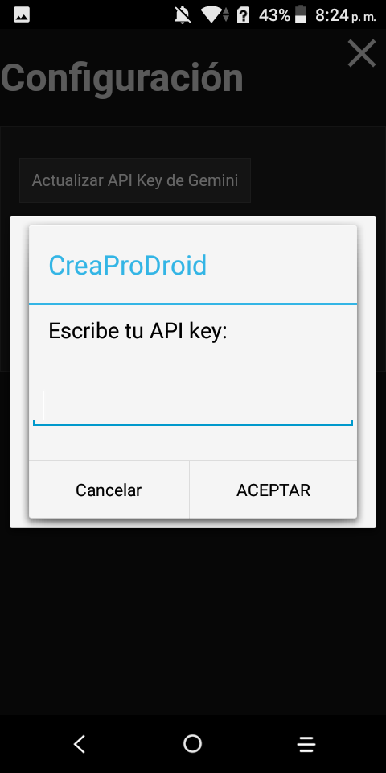
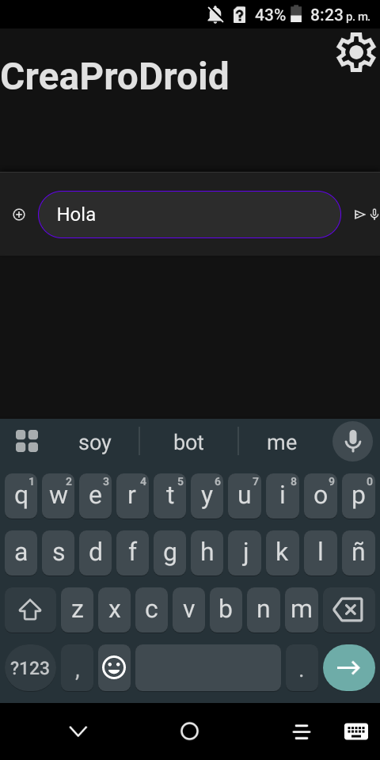
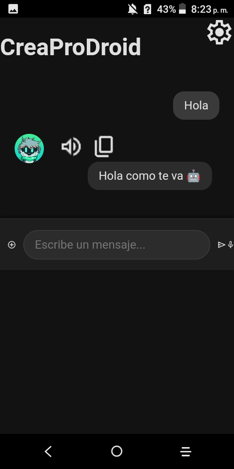
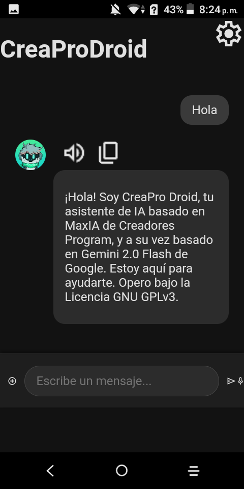
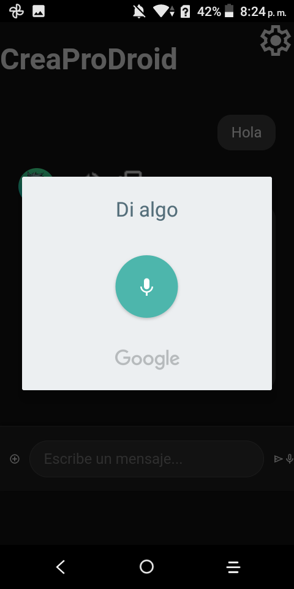

# CreaProDroid

CreaProDroid es un asistente de inteligencia artificial diseñado específicamente para dispositivos Android antiguos (versiones 4.2 a 8.1). Este asistente utiliza la tecnología de Google Gemini y está optimizado para ofrecer una experiencia fluida y útil en dispositivos con recursos limitados.

## **Características**
- **Asistente de IA**: Responde preguntas, realiza tareas y ofrece asistencia personalizada.
- **Compatibilidad con Android Antiguo**: Diseñado para funcionar en dispositivos con Android 4.2 a 8.1.
- **Reconocimiento de Voz**: Permite interactuar mediante comandos de voz.
- **Generación de Imágenes**: Genera imágenes basadas en descripciones proporcionadas por el usuario.
- **Apertura de Aplicaciones**: Puede abrir aplicaciones instaladas en el dispositivo.
- **Soporte para Archivos**: Procesa archivos de texto proporcionados por el usuario.
- **Interfaz Amigable**: Diseño intuitivo y fácil de usar.

## **Requisitos**
- **Versión de Android**: 4.2 (Jelly Bean) a 8.1 (Oreo).
- **Permisos Necesarios**:
  - Acceso a Internet.
  - Lectura y escritura en almacenamiento externo.
  - Uso del micrófono para reconocimiento de voz.

## **Instalación**
1. Descarga el archivo APK desde la [página de lanzamientos](https://github.com/Creadores-Program/CreaProDroid/releases).
2. Habilita la instalación desde fuentes desconocidas en tu dispositivo Android.
3. Instala el APK y abre la aplicación.

## **Uso**
1. **Configuración Inicial**:
   - Ingresa tu API Key de Google Gemini obtenida desde [Google AI Studio](https://aistudio.google.com/app/apikey).
   - Proporciona tu nombre para personalizar la experiencia.
2. **Interacción**:
   - Escribe o habla tus preguntas o comandos.
   - Usa el botón de micrófono para comandos de voz.
   - Adjunta archivos para procesarlos.
3. **Funciones Adicionales**:
   - Genera imágenes basadas en descripciones.
   - Abre aplicaciones instaladas en tu dispositivo.
   - Borra el historial de chat cuando lo desees.

## **Capturas de Pantalla**
| Capturas | Capturas | Capturas |
|----------|----------|----------|
|  |  |  |
|  |  |  |
|  |  |  |
|  |

## **Contribución**
Si deseas contribuir al desarrollo de CreaProDroid:
1. Haz un fork del repositorio.
2. Realiza tus cambios en una rama nueva.
3. Envía un pull request con una descripción detallada de tus cambios.

## **Licencia**
CreaProDroid está licenciado bajo la [GNU GPLv3](https://www.gnu.org/licenses/gpl-3.0.html).

## **Contacto**
Para preguntas o soporte, contacta a [Creadores Program](https://github.com/Creadores-Program) [CreadoresProgram Discord](https://discord.com/invite/mrmHcwxXff).

## Creditos
- Github Copilot
- Microsoft Copilot
- Gemini
- MarkdownToHtml for es5
- Google Fonts
- Support Custom Tabs
- Okhttp
- okio
- Support App Compats
- Support Compat v4
- JavaStudio Android
